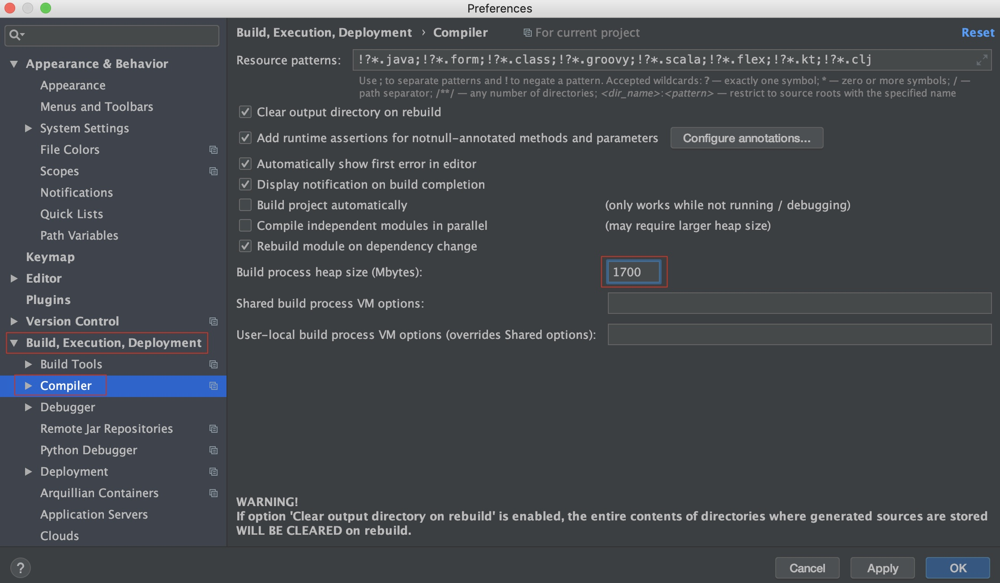

IDEA走读Java源码坏境搭建
---
1. 新建一个普通java项目（如：java8-source）
2. 创建package（tech.sqlclub.java_source）存放java源码

   > java源码在$JAVA_HOME/src.zip 解压就行，mac用户JAVA_HOME查看如下图：
   >
   > 
3. 通过Debug，撸java源码：

   你会发现执行debug会报下面错误run不起来：
   
   这是因为加了java源码，代码过多heap大小不够，你可以设置：
   
   这时候发现不报错了，但是进不了java源码，这是因为idea默认不让step into java源码的包，你可以设置：
   
   这是时候进入的是系统的jdk而非项目中的源码，你可以进行选择：
   
   如果不能直接切换，也可以手工将idea项目的源码加入到SDKs的sourcePath中，并把系统的给删除：
   
   删除红框的src

到此，你可以开始尽情地撸java源码了，记住尽量要**多读源码，多读源码**，多学习，共勉！
   
   
   
   
